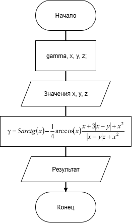

# Домашнее задание к работе 5

### Условие:
Создать программу вычисления указанной величины. Результат проверить при заданных исходных значениях.

### Алгоритм:
1. Начало      
2. Объявить переменные;        
	`double gamma, x, y, z;`    
3. Считать введённый вес игрушек;      
	`scanf("%lf", &x);`    
	 `...`   
4. Вычислить значение;  
	`gamma = 5 * (atan(x)) - (1. / 4.) * (acos(x)) * ((x + 3. * fabs(x - y) + pow(x, 2.)) / (fabs(x - y) * z + pow(x, 2.)));`    
5. Выввести результат пользователю;  
    `printf("Ответ: %.6f", gamma);`  
5. Конец.    

### Блок-схема:



## 2. Реализация программы 

```
#include <stdio.h>
#include <stdlib.h>
#define _USE_MATH_DEFINES
#include <math.h>
#include <locale.h>

int main()
{ // вариант 7 (9%33+1)
	setlocale(LC_ALL,"RUS");

    double gamma, x, y, z;

	puts("Введите очерёдно значения x, y, z:");

	scanf("%lf", &x);
	scanf("%lf", &y);
	scanf("%lf", &z);

	gamma = 5 * (atan(x)) - (1. / 4.) * (acos(x)) * ((x + 3. * fabs(x - y) + pow(x, 2.)) / (fabs(x - y) * z + pow(x, 2.)));

	printf("Ответ: %.6f", gamma);
	return 0;
}

/* Для проверки использовать: 
x = 0.1722;
y = 6.33;
z = 0.000325;
Получим: -205,305571
*/
```
## 3. Результаты работы программы

Введите очерёдно значения x, y, z:   
0,1722    
6,33    
0,000325      
Ответ: -205,305571          

## 4. Информация о разработчике

Кравченко В.В. бИЦ-251